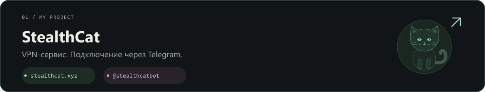
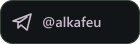
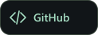
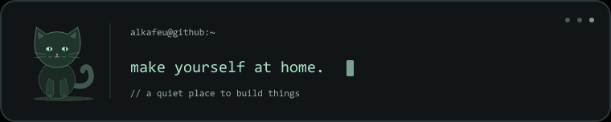

<picture>
  <source media="(prefers-reduced-motion: reduce)" srcset="assets/header-static.svg">
  
</picture>

 

### Привет, я alkafeu 👋

Развиваю **StealthCat** — VPN-сервис с подключением через Telegram.  
Работаю над ботом, веб-интерфейсами и инфраструктурой проекта.

 

  
  
  
  

Репозиторий проекта: <a href="https://github.com/alkafeu/StealthKitty">StealthKitty ↗</a>

 

  <picture>
    <source media="(prefers-reduced-motion: reduce)" srcset="assets/terminal-static.png">
    
  </picture>

  code · curiosity · cats

