<picture>
  <source media="(max-width: 600px) and (prefers-reduced-motion: reduce)" srcset="assets/profile-mobile-static.svg">
  <source media="(max-width: 600px)" srcset="assets/profile-mobile.svg">
  <source media="(prefers-reduced-motion: reduce)" srcset="assets/profile-static.svg">
  
</picture>

<a href="https://stealthcat.xyz/"><picture><source media="(max-width: 600px)" srcset="assets/grid-website-mobile.svg"></picture></a><a href="https://t.me/stealthcatbot"><picture><source media="(max-width: 600px)" srcset="assets/grid-bot-mobile.svg"></picture></a>

<a href="https://t.me/alkafeu"><picture><source media="(max-width: 600px)" srcset="assets/grid-telegram-mobile.svg"></picture></a><a href="https://github.com/alkafeu"><picture><source media="(max-width: 600px)" srcset="assets/grid-github-mobile.svg"></picture></a>

[Код проекта: StealthKitty ↗](https://github.com/alkafeu/StealthKitty)

  
Баннер StealthCat

  

