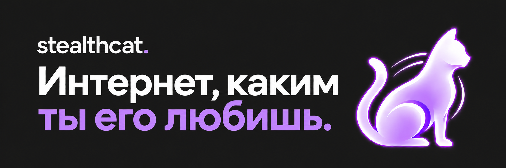
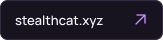
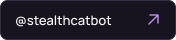
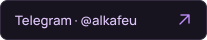
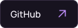
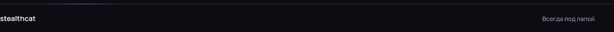

<picture>
  <source media="(prefers-reduced-motion: reduce)" srcset="assets/profile-hero-static.svg">
  
</picture>

 

Развиваю **[StealthCat](https://stealthcat.xyz/)** — VPN-сервис с подключением через Telegram. 
Работаю над ботом, веб-интерфейсами и инфраструктурой проекта.

 

  
  
  
  

Репозиторий проекта: <a href="https://github.com/alkafeu/StealthKitty">StealthKitty ↗</a>

<picture>
  <source media="(prefers-reduced-motion: reduce)" srcset="assets/signature-static.png">
  
</picture>
